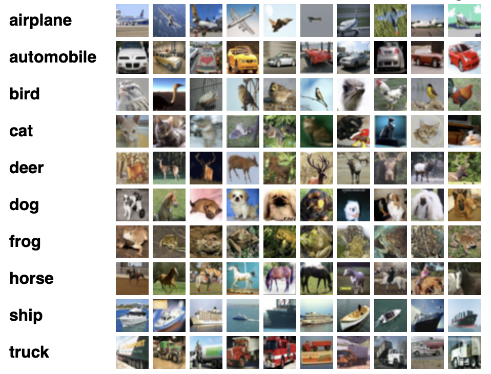

If you have a model that has been trained in Python with [Keras](https://keras.io), and you need to embed it in a 
JVM application, KotlinDL can help you with that.

In this tutorial you'll learn how you should save your Keras model so that it's compatible with KotlinDL, what 
architectures are currently supported, and how to load and run inference with such model from your JVM project. 
  
### Supported architectures
KotlinDL 0.1 preview supports limited number of deep learning architectures. As the project evolved, we will be expanding 
the list of supported architectures.

Currently, the following layers are supported: 
- Input()
- Flatten()
- Dense()
- Dropout()
- Conv2D()
- MaxPool2D()
- AvgPool2D()   

### Saving a trained Keras model 
For the purposes of this tutorial, we'll train a simple convolutional neural network that can classify 
images from the CIFAR-10 dataset in Python, and then load it with KotlinDL.

---
**About CIFAR-10**

The [CIFAR-10 dataset](https://www.cs.toronto.edu/~kriz/cifar.html) consists of 60000 32x32 colour images in 10 
classes, with 6000 images per class. Here are some examples: 



--- 
 
Here's how we define the neural network that we will train and use the resulting model: 
```python
model = models.Sequential(
[
    layers.Conv2D(32, (3, 3), activation='relu', input_shape=(32, 32, 3)),
    layers.MaxPooling2D((2, 2)),
    layers.Conv2D(64, (3, 3), activation='relu'),
    layers.MaxPooling2D((2, 2)), 
    layers.Conv2D(64, (3, 3), activation='relu'),
    layers.Flatten(),
    layers.Dense(64, activation='relu'),
    layers.Dense(10)
])
```

Here's the model's architecture: 

```
Model: "sequential"
_________________________________________________________________
Layer (type)                 Output Shape              Param #   
=================================================================
conv2d (Conv2D)              (None, 30, 30, 32)        896       
_________________________________________________________________
max_pooling2d (MaxPooling2D) (None, 15, 15, 32)        0         
_________________________________________________________________
conv2d_1 (Conv2D)            (None, 13, 13, 64)        18496     
_________________________________________________________________
max_pooling2d_1 (MaxPooling2 (None, 6, 6, 64)          0         
_________________________________________________________________
conv2d_2 (Conv2D)            (None, 4, 4, 64)          36928     
_________________________________________________________________
flatten (Flatten)            (None, 1024)              0         
_________________________________________________________________
dense (Dense)                (None, 64)                65600     
_________________________________________________________________
dense_1 (Dense)              (None, 10)                650       
=================================================================
Total params: 122,570
Trainable params: 122,570
Non-trainable params: 0
```

You can find a Jupyter notebook with Python code used to train this model [here](CIFAR-10.ipynb). 

Once this model is trained, it's important to properly save it so that we could load it from KotlinDL:
```python
model.save('keras-cifar-10/weights', save_format='h5')

model_json = model.to_json()
with open("keras-cifar-10/model.json", "w") as json_file:
    json_file.write(model_json)
```

We need to save two things:
1) **model weights**: the result of the training. Make sure to specify `save_format='h5'`. This will save the model to disk in 
 HDF5 format as opposed to the default SavedModel format. KotlinDL requires HDF5 format to properly load model's weights.
2) **model architecture** as a JSON file. 

### Loading the model and running inference
Once you have the HDF5 and JSON model files, you can load and use the model from your project.  Note, that whatever 
preprocessing has been done to the images before training the model, needs to be done before running inference as well.

In this case we only normalized the pixel values before training, and KotlinDL provides a convenient method to read an 
 image srtaight into a normalized array, so you don't have to do it manually - `ImageConverter.toNormalizedFloatArray()`. 

```kotlin
val labelsMap = mapOf(
    0 to "airplane",
    1 to "automobile",
    2 to "bird",
    3 to "cat",
    4 to "deer",
    5 to "dog",
    6 to "frog",
    7 to "horse",
    8 to "ship",
    9 to "truck"
)

val imageArray = ImageConverter.toNormalizedFloatArray(File(PATH_TO_IMAGE))

fun main() {
    val JSONConfig = File(PATH_TO_MODEL_JSON)
    val weights = File(PATH_TO_WEIGHTS)

    val model = Sequential.loadModelConfiguration(JSONConfig)

    model.use {
        it.compile(Adam(), Losses.SOFT_MAX_CROSS_ENTROPY_WITH_LOGITS, Metrics.ACCURACY)

        val hdfFile = HdfFile(weights)
        it.loadWeights(hdfFile)

        val prediction = it.predict(imageArray)
        println("Predicted label is: $prediction. This corresponds to class ${labelsMap[prediction]}.")
    }
}
```

As you can see, loading and using a model trained with Keras is quite simple. If the architecture is supported, all 
you need to do is save the weights and JSON configuration after training, load it from KotlinDL, and make sure to 
preprocess your data before running the inference exactly the same way it was preprocessed for training.  


  
